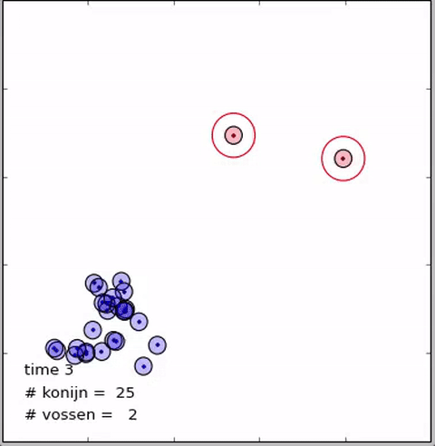
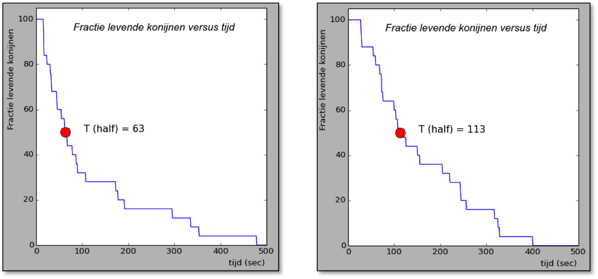

## Assignment 3: population dynamics (death - foxes eat rabbits)

In nature foxes and rabbits do not live harmoniously alongside each other. When a fox encounters a rabbit he'll eat said rabbit. Part of this assignment is to  study how long it takes (on average) for the foxes to eat half of the rabbits. We also study whether it is better for the rabbits to sit still occasionally or just run around continuously instead.

We'll now make an adjustment to the code you wrote for assignment 1 and 2. Create a new Python file, `predator_prey_3.py`, and copy all code you've written in the previous assignments into the new file.

#### Part (3a): vanishing rabbits

The first part of this assignment is to simulate rabbits getting eaten when they come too close to a fox. Declare a new function `dinnertime()` that is called in the 'main function' `predator_prey()` after the move functions, `move_rabbits()` and `move_foxes()`. This function is tasked with evaluating, for each rabbit, whether they are too close to a fox. 'Too close' means: within 5 meters of the nearest fox. If so, the rabbit is eaten and it should be removed from the list of rabbits.

Iterating and removing an element creates a couple of issues. When you iterate over a list of 20 elements and remove element 10, all remaining elements after the removed element move over 1 position. Element 11 in the original list becomes element 10 in the new list etc. The list is also now only 19 elements large and when you eventually reach rabbit 20 it will no longer exist. To remedy this problem, create a new list that will replace the old one. During iteration, you can then use `append()` to add elements to the new list:

    new_list = []

    for i in range(old_list):
      new_list.append(old_list[i])

Simply make sure you do not add the rabbits that have been eaten, using an `if` statement, and you've essentially removed it from the list. When a rabbit is eaten remove the corresponding element from **all** lists: x-position, y-position and angles.

{:.inline}{: style="width:30%"}

Add the finishing touch by `print`ing what time step `t` we are currently on to the screen and how many foxes and rabbits are still in the forest at that point in time.

#### Part (3b): Calculate the time at which the rabbit population is halved (+ plot)

When we run the simulation for a longer period of time we'll eventually reach a moment in time where the foxes have eaten half of all the rabbits. How many simulation-seconds does that take?

<b>Before we start:</b> Displaying the moving and disappearing rabbits to the screen is very time-consuming. When simulating 100 time steps it works just fine, but when running longer or multiple simulations it is no longer practical. Sure, we can decrease the `plt.pause(0.1)` to 0.001 seconds instead of 0.1 seconds, but it is even better if we are able to temporarily disable the visualization. Make sure you add a Boolean variable to your `predator_prey()` function that allows you to easily choose if you do or do not want to call the `draw_forest()` function. From now on we won't be running the visualization unless you want to do it yourself.

> Visualizing still is more than 'just fun', it is incredibly important to simulations. It is a powerful tool to debug your cod, like you've more than likely already experienced earlier in the module, when you were implementing the edge of the forest or the `dinnertime()` function.

To calculate the time at which at least half of the rabbits were eaten, we'll edit two parts of the program:

   1. Let the simulation run for 1000 (simulated) seconds and keep track of the number of rabbits by appending it to a list for each time step within the `predator_prey()` function. Then `return` that list at the end of the function.

   2. Declare a new function `calculate_half_life()` that runs the `predator_prey()` function once. Because `predator_prey()` now returns the list containing the numbers of rabbits in each time step you can use it to calculate what the first moment is that only half (or less than half) the original amount of rabbits is left in the forest. The function `calculate_half_life()` should return the second at which this happens.

The time that foxes require eat at least half of the rabbits will be different for each separate simulation. Below you can see a couple of graphs of the number of rabbits as a function of the time for two simulations. Before we calculate the average time after which 50% of the rabbits has disappeared for 1000 unique simulations, it is important to know that the values that you find are correct. First, try to reproduce these graphs to see whether you do indeed collect the correct data from you simulation.

 {: style="width:65%"}

At the end of your simulation the following should be displayed on the screen:

{: .language-python}   
    After x seconds more than half the rabbits have been eaten

#### Part (3c): Average amount of time after which the rabbit population is halved

Our new function `calculate_half_time()` is constructed such that the function `predator_prey()` is only called once. However, as you've already seen, there is a relatively large spread in half-life between different simulations. To determine the _average_ half-life we'll need to run a large number of simulations, determine the half-life of each, and finally use all numbers to calculate the average.

> The graphs of the number of rabbits as function of the time that we've created for the previous part of the assignment were created to see if your calculation of the half-life was correct. Now that we're sure about that we can leave the graph out of our output. Adjust the code so that the graph is only shown when we run `predator_prey()` once. for the rest of the assignment we'll look at values for multiple simulations at which point this graph no longer matters.

Program the function `average_half_life()`, which calculates the average half-life over a greater number of simulations. It should call `predator_prey()` not once, but instead 500 times. It should store each half-life recorded and when done, calculate the average half-life. This function might take quite a while to run, so make sure at every 25 simulations the program `print`s what simulation is being run. You might also want to test it with a lower number of simulations first.

The terminal should show the following after the final simulation:
{: .language-python}   
    A simulated world with: N_rabbits=25 (v=1), N_fox=2 (v=2), N_simulations=500:
        Average half-life of rabbits = x.xx seconds

#### Part (3d): Strategy rabbits: does it help to adjust our speed?

In the previous assignment we determined the average half-life of the rabbit population at a specific speed (v=1). The rabbits probably don't want to die and should figure something out. Point of discussion between the rabbits is whether they should just run around real fast or instead stay put hoping the foxes don't find them. It's up to us to find the rabbits' optimal strategy.

To answer this question we'll run the function `average_half_life()` with various speeds for the rabbits. You may adjust the value of `rabbits_speed` manually between runs in the `predator_prey()` function. You may also just write down the results of each run. Try the following speeds for the rabbits: speeds of 0.0, 0.5, 1.0, 1.5, 2.0, 2.5 and even 5.0 meters per second and finally create a graph of the average half-life's as a function of the speed of the rabbits. What strategy is more beneficial to the rabbits?

`Print` the values you've found to the screen:
{: .language-python}   
    A simulated world with: N_rabbits=25, N_fox=2 (v=1), N_simulations = 500:
        Rabbit speed = 0.0 m/s -> Average half-life of rabbits = x.xx seconds
        Rabbit speed = 0.5 m/s -> Average half-life of rabbits = x.xx seconds
        Rabbit speed = 1.0 m/s -> Average half-life of rabbits = x.xx seconds
        ...     
